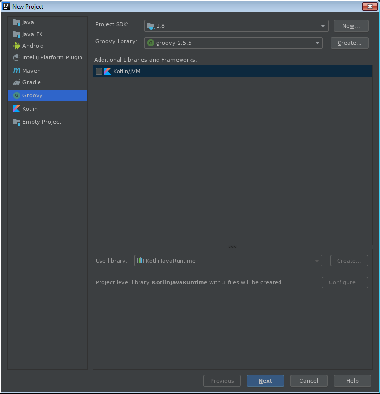
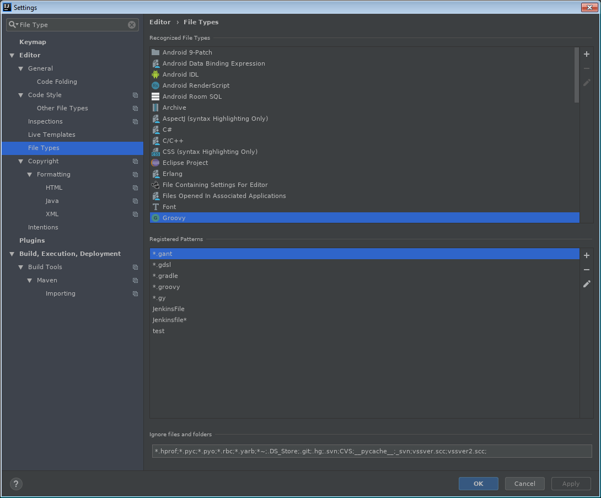
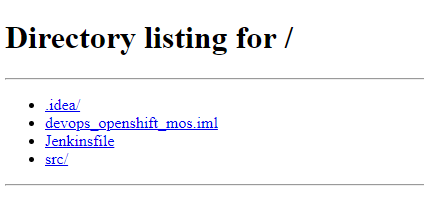
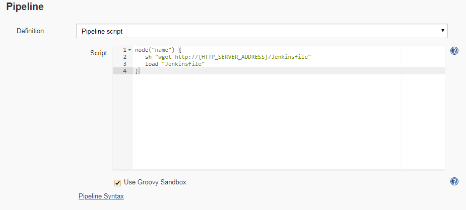

# Автодополнение и проверка синтаксиса в Intelij IDEA для GDSL

Разрабатывать Pipeline в самом Jenkins(в вебке) то еще удовольствие. 

Как сделать разработку намного удобнее.

- [Установка Groovy](#install-Groovy)
   - [Установка Groovy на RHEL 7](#groovy-rhel7)
- [Создание нового Groovy проекта для разработки pipeline](#new-project)
- [Автодополнение при написании Jenkinsfile](#autocompletion) 
   - [Автодополнение для Scripted Pipeline Syntax](#Автодополнение-для-Scripted-Pipeline-Syntax)

## Установка Groovy


Необходимо установить Groovy в систему.

### Установка Groovy на RHEL 7

1. Скачать "Binary Release"  c [groovy-lang.org](http://groovy-lang.org/install.html)

2. Распаковать пакет

```
# unzip apache-groovy-binary-2.5.5.zip
``` 
3. Переместить пакет
```
# mkdir /usr/local/groovy
# mv groovy-2.5.5 /usr/local/groovy
# cd /usr/local/groovy
# ln -s groovy-2.5.5 ./latest
```
4. Добавить в bash_profile
```
export GROOVY_HOME=/usr/local/groovy/latest
export PATH=$GROOVY_HOME/bin:$PATH
```
5. Поправить права на каталог
```
chmod -R o+x /usr/local/groovy/bin
chmod -R o+r /usr/local/groovy
```
## Создание нового Groovy проекта для разработки pipeline

Создаю новый Groovy проект в котором буду разрабатывать Jenkinsfile

 

В корне проекта должен появиться каталог src

## Автодополнение при написании Jenkinsfile 
***
 Связать Jenkinsfile файл с Groovy. Выбрать **File->Settings->File Types** и добавить 

в шаблоны Jenkinsfile*., можно добавить любой шаблон 

 


 После этого должно заработать автодополнение и подсказки от Groovy языка. Но в случае

 Jenkinsfile - это Groovy DSL. Для того, чтобы работало автодополнение в Jenkinsfile, учитывающее

 синтакс Pipeline нужно подложить pipeline.gdsl, но структура файла отличается в зависисости от типа
 
 синтаксиса в Pipeline.

### Автодополнение для Scripted Pipeline Syntax

>Scripted Pipeline, like Declarative Pipeline, is built on top of the underlying Pipeline sub-system. Unlike Declarative, Scripted Pipeline is effectively a general purpose DSL [2] built with Groovy. Most functionality provided by the Groovy language is made available to users of Scripted Pipeline, >
>which means it can be a very expressive and flexible tool with which one can author continuous delivery pipelines.
>
>Flow Control
>
>Scripted Pipeline is serially executed from the top of a Jenkinsfile downwards, like most traditional scripts in Groovy or other languages. Providing flow control therefore rests on Groovy expressions, such as the if/else conditionals, for example:
>
>
> Example^
>
>```groovy
>node {
>    stage('Example') {
>        if (env.BRANCH_NAME == 'master') {
>            echo 'I only execute on the master branch'
>        }
>        else {
>            echo 'I execute elsewhere'
>        }
>    }
>}
>```

 1. Скачать файл pipeline.gdsl

 ```
 curl --user username:password https://{YOUR_JENKINS_ADRESS}/job/{YOUR_PIPELINE}/pipeline-syntax/gdsl --insecure -o pipeline.gdsl
 ```

2.  Сохранить файл в каталоге **src** проекта, иначе IDEA его не подтянет.

После этого автодополнение должно заработать.

### Автодополнение для Declarative Pipeline Syntax

> All valid Declarative Pipelines must be enclosed within pipeline block, for example:
> ```groovy
> pipeline {
>    /* insert Declarative Pipeline here */
>}
>```
>The basic statements and expressions which are valid in Declarative Pipeline follow the same rules as Groovy’s syntax with the following exceptions:
>
>* The top-level of the Pipeline must be a block, specifically: pipeline { }
>
>* No semicolons as statement separators. Each statement has to be on its own line
>
>* Blocks must only consist of Sections, Directives, Steps, or assignment statements.
>
>* A property reference statement is treated as no-argument method invocation. So for example, input is treated as input()
>
>You can use the Declarative Directive Generator to help you get started with configuring the directives and sections in your Declarative Pipeline.

1. Файл pipeline.gdsl с поддержкой DPS я скачал с [github](https://gist.github.com/ggarcia24).

2. Сохранил файл в корне проекта в каталоге src.

3. Взял недостающие методы из файла, скачанного с Jenkins и добавил в файл в секцию.
```
contributor(closures)
```

А вот как выглядит автодополнение


Что очень удобно.


# Отладка Pipeline без постояныых коммитов.

В Jenkins не так много вариантов, как подтянуть Jenkinsfile. Как вариант разместить

Jenkinsfile в Git с помощью **Pipeline Script from SCM**. Это удобно при выполнении

уже разработанного кода, но отлаживать весьма неудобно. Приходиться при каждом изменении

комититься, что прямо бесит.

Я решил так

## HTTP сервер

Для начала устанавливаю 2 пакета из репозитория.

```
# yum install python36.x86_64 python36-libs.x86_64

```

Перехожу в каталог, в котором у меня размещен Jenkinsfile и поднимаю простой HTTP server.

```
# python36 -m http.server 80
Serving HTTP on 0.0.0.0 port 80 (http://0.0.0.0:80/) ...
```

HTTP сервер поднят. Можно открыть браузер и проверить, что файлы доступны.



А в Jenkins подключаем скрипт с помощью метода load
```groovy
node("name") {
   sh "wget http://{HTTP_SERVER_ADDRESS}/Jenkinsfile"
   load "Jenkinsfile"
}
```



Теперь можно отлаживать код без лишних коммитов.


