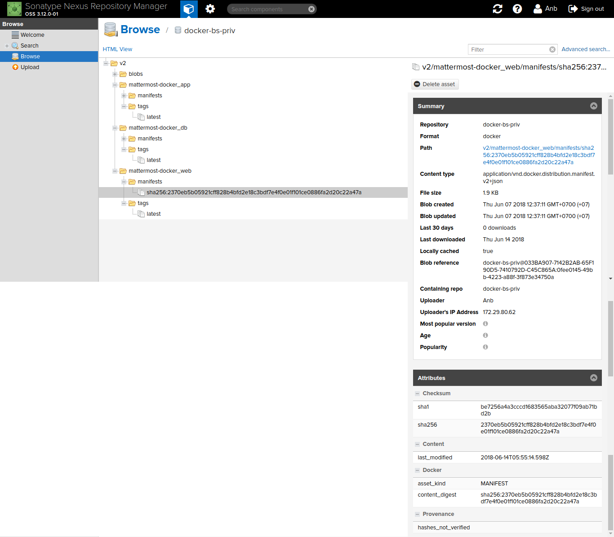

# Установка и настройка mattermost (сборка своего образа).

Author: Andrey Bazarnyy(a.bazarnyy@cft.ru)

по дефаулту в родных образах Mattermost редакция Enterprise - она платная, надо использовать редакцию team (команда)- это бесплатно
надо склонировать проект и пересобрать образы.

устанавливаем переменные окружения на проксю
~~~
# export http_proxy=http://localhost:3128
# export https_proxy=http://localhost:3128
# export no_proxy='localhost,.ftc.ru,127.0.0.1'
~~~

прокидываем тунель на прокси на доступню прокси
~~~
# ssh -4 -o ExitOnForwardFailure=yes -fNL 3128:localhost:3128 oracle@bftops
oracle@bftops's password:
~~~ 

проверяем наличие прослушивания порта
~~~
# netstat -an|grep 3128
tcp        0      0 127.0.0.1:3128          0.0.0.0:*               LISTEN     

~~~
клонируем проект
~~~
# git clone https://github.com/mattermost/mattermost-docker/
Cloning into 'mattermost-docker'...
remote: Counting objects: 1013, done.
remote: Compressing objects: 100% (11/11), done.
remote: Total 1013 (delta 3), reused 6 (delta 2), pack-reused 1000
Receiving objects: 100% (1013/1013), 205.80 KiB | 267.00 KiB/s, done.
Resolving deltas: 100% (486/486), done.

~~~

редактируем файл docker-compose.yml
Добавляем аргументы для прокси
~~~ yaml
      args:
        - http_proxy=http://localhost:3128
        - https_proxy=http://localhost:3128
        - no_proxy=*.ftc.ru,localhost,*.cft.ru,127.0.0.1
~~~
и редакцию team для app
~~~ yaml
 - edition=team
~~~
~~~
# cat docker-compose.yml 
version: "3"

services:

  db:
    build:
      context: db
      args:
        - http_proxy=http://localhost:3128
        - https_proxy=http://localhost:3128
        - no_proxy=*.ftc.ru,localhost,*.cft.ru,127.0.0.1
    read_only: true
    restart: unless-stopped
    volumes:
      - ./volumes/db/var/lib/postgresql/data:/var/lib/postgresql/data
      - /etc/localtime:/etc/localtime:ro
    environment:
      - POSTGRES_USER=mmuser
      - POSTGRES_PASSWORD=mmuser_password
      - POSTGRES_DB=mattermost
    # uncomment the following to enable backup
    #  - AWS_ACCESS_KEY_ID=XXXX
    #  - AWS_SECRET_ACCESS_KEY=XXXX
    #  - WALE_S3_PREFIX=s3://BUCKET_NAME/PATH
    #  - AWS_REGION=us-east-1

  app:
    build:
      context: app
      # comment out following lines for team edition or change UID/GID
      args:
        - http_proxy=http://localhost:3128
        - https_proxy=http://localhost:3128
        - no_proxy=*.ftc.ru,localhost,*.cft.ru,127.0.0.1
        - edition=team
      #   - PUID=1000
      #   - PGID=1000
    restart: unless-stopped
    volumes:
      - ./volumes/app/mattermost/config:/mattermost/config:rw
      - ./volumes/app/mattermost/data:/mattermost/data:rw
      - ./volumes/app/mattermost/logs:/mattermost/logs:rw
      - /etc/localtime:/etc/localtime:ro
    environment:
      # set same as db credentials and dbname
      - MM_USERNAME=mmuser
      - MM_PASSWORD=mmuser_password
      - MM_DBNAME=mattermost
      # in case your config is not in default location
      #- MM_CONFIG=/mattermost/config/config.json

  web:
    build: 
      context: web
      args:
        - http_proxy=http://localhost:3128
        - https_proxy=http://localhost:3128
        - no_proxy=*.ftc.ru,localhost,*.cft.ru,127.0.0.1
    ports:
      - "80:80"
      - "443:443"
    read_only: true
    restart: unless-stopped
    volumes:
      # This directory must have cert files if you want to enable SSL
      - ./volumes/web/cert:/cert:ro
      - /etc/localtime:/etc/localtime:ro
    # Uncomment for SSL
    # environment:
    #  - MATTERMOST_ENABLE_SSL=true

~~~

Запускаем билд проекта
~~~

# ls
app  contrib  db  docker-compose.yml  LICENSE  MAINTENANCE.md  README.md  web

# docker-compose build
Building db
Step 1/9 : FROM postgres:9.4-alpine
 ---> dc558eb464df
Step 2/9 : ENV DEFAULT_TIMEZONE UTC
 ---> Using cache
 ---> d45e9cfabb46
Step 3/9 : RUN apk add --no-cache       build-base       curl       libc6-compat       libffi-dev       linux-headers       python-dev       py-pip       
py-cryptography     && pip --no-cache-dir install 'wal-e<1.0.0' envdir     && rm -rf /var/cache/apk/* /tmp/* /var/tmp/*
 ---> Using cache
 ---> 8541639ee91a
Step 4/9 : COPY setup-wale.sh /docker-entrypoint-initdb.d/
 ---> Using cache
 ---> 9040668339c4
Step 5/9 : HEALTHCHECK CMD pg_isready -U postgres || exit 1
 ---> Using cache
 ---> d836719b22eb
Step 6/9 : COPY entrypoint.sh /
 ---> Using cache
 ---> 9f5222fc5fa0
Step 7/9 : ENTRYPOINT /entrypoint.sh
 ---> Using cache
 ---> 942a276a54be
Step 8/9 : CMD postgres
 ---> Using cache
 ---> c69b0e58d998
Step 9/9 : VOLUME /var/run/postgresql /usr/share/postgresql/ /var/lib/postgresql/data /tmp
 ---> Using cache
 ---> 11c8583c55e2
Successfully built 11c8583c55e2
Successfully tagged mattermost-docker_db:latest
Building app
Step 1/17 : FROM alpine:3.6
 ---> 77144d8c6bdc
Step 2/17 : ENV PATH "/mattermost/bin:${PATH}"
 ---> Using cache
 ---> b3ffc142c567
Step 3/17 : ENV MM_VERSION 4.10.1
 ---> Using cache
 ---> c57d40e4eefa
Step 4/17 : ARG edition=enterprise
 ---> Using cache
 ---> 7b052cd60cb4
Step 5/17 : ARG PUID=2000
 ---> Using cache
 ---> 5039e1f381c3
Step 6/17 : ARG PGID=2000
 ---> Using cache
 ---> 2cec6a83b8ae
Step 7/17 : RUN apk add --no-cache 	ca-certificates 	curl 	jq 	libc6-compat 	libffi-dev 	linux-headers 	mailcap 	
netcat-openbsd 	xmlsec-dev 	&& rm -rf /tmp/*
 ---> Using cache
 ---> c606391f3378
Step 8/17 : RUN mkdir -p /mattermost/data     && if [ "$edition" = "team" ] ; then curl https://releases.mattermost.com/$MM_VERSION/mattermost-team-$MM_VERSION-linux-amd64.tar.gz | tar -xvz ;       
else curl https://releases.mattermost.com/$MM_VERSION/mattermost-$MM_VERSION-linux-amd64.tar.gz | tar -xvz ; fi   
  && cp /mattermost/config/config.json /config.json.save     && rm -rf /mattermost/config/config.json
 ---> Using cache
 ---> f6157ab55c5d
Step 9/17 : RUN addgroup -g ${PGID} mattermost     && adduser -D -u ${PUID} -G mattermost -h /mattermost -D mattermost     && chown -R mattermost:mattermost /mattermost /config.json.save
 ---> Using cache
 ---> 67943f8b3de8
Step 10/17 : USER mattermost
 ---> Using cache
 ---> 3be703156a9c
Step 11/17 : HEALTHCHECK CMD curl --fail http://localhost:8000 || exit 1
 ---> Using cache
 ---> 47aafb8570ea
Step 12/17 : COPY entrypoint.sh /
 ---> Using cache
 ---> 33614507aec3
Step 13/17 : ENTRYPOINT /entrypoint.sh
 ---> Using cache
 ---> 74b89b10a764
Step 14/17 : WORKDIR /mattermost
 ---> Using cache
 ---> 28c47b9cf2fb
Step 15/17 : CMD platform
 ---> Using cache
 ---> 5af2b386b7b1
Step 16/17 : EXPOSE 8000
 ---> Using cache
 ---> 3d4c73f18951
Step 17/17 : VOLUME /mattermost/data /mattermost/logs /mattermost/config
 ---> Using cache
 ---> ae915db03a48
Successfully built ae915db03a48
Successfully tagged mattermost-docker_app:latest
Building web
Step 1/8 : FROM nginx:mainline-alpine
 ---> bc7fdec94612
Step 2/8 : RUN rm /etc/nginx/conf.d/default.conf     && apk add --no-cache curl
 ---> Using cache
 ---> 385b3f9a478f
Step 3/8 : COPY ./mattermost ./mattermost-ssl /etc/nginx/sites-available/
 ---> Using cache
 ---> cc0d292a928d
Step 4/8 : COPY ./security.conf /etc/nginx/conf.d/
 ---> Using cache
 ---> f5a9acad2288
Step 5/8 : COPY entrypoint.sh /
 ---> Using cache
 ---> 73be067e77e2
Step 6/8 : HEALTHCHECK CMD curl --fail http://localhost:80 || exit 1
 ---> Using cache
 ---> df64bc784218
Step 7/8 : ENTRYPOINT /entrypoint.sh
 ---> Using cache
 ---> b8cca01b2fa4
Step 8/8 : VOLUME /var/run /etc/nginx/conf.d/ /var/cache/nginx/
 ---> Using cache
 ---> 632585dee360
Successfully built 632585dee360
Successfully tagged mattermost-docker_web:latest

~~~

проверяем образы

~~~
# docker images matte*
REPOSITORY              TAG                 IMAGE ID            CREATED             SIZE
mattermost-docker_db    latest              11c8583c55e2        6 days ago          387MB
mattermost-docker_web   latest              632585dee360        7 days ago          19.4MB
mattermost-docker_app   latest              ae915db03a48        7 days ago          258MB

~~~

Если запустить образы, то в приложении app будет ошибка
приложение будет уходить в постоянный рестарт

~~~
[root@anboel mattermost-docker]# docker-compose up -d
Creating network "mattermost-docker_default" with the default driver
Creating mattermost-docker_app_1 ... done
Creating mattermost-docker_web_1 ... done
Creating mattermost-docker_db_1  ... done

[root@anboel mattermost-docker]# docker ps -a
CONTAINER ID        IMAGE                   COMMAND                  CREATED              STATUS                                 PORTS                                      NAMES
fb7f480282f8        mattermost-docker_db    "/entrypoint.sh po..."   About a minute ago   Up About a minute (healthy)            5432/tcp                                   mattermost-docker_db_1
a58c0f81af66        mattermost-docker_web   "/entrypoint.sh"         About a minute ago   Up About a minute (health: starting)   0.0.0.0:80->80/tcp, 0.0.0.0:443->443/tcp   mattermost-docker_web_1
98ad4c9bbd62        mattermost-docker_app   "/entrypoint.sh pl..."   About a minute ago   Restarting (1) 37 seconds ago                                                     mattermost-docker_app_1
.....
.....

[root@anboel mattermost-docker]# docker ps -a
CONTAINER ID        IMAGE                   COMMAND                  CREATED             STATUS                          PORTS                                      NAMES
fb7f480282f8        mattermost-docker_db    "/entrypoint.sh po..."   3 minutes ago       Up 3 minutes (healthy)          5432/tcp                                   mattermost-docker_db_1
a58c0f81af66        mattermost-docker_web   "/entrypoint.sh"         3 minutes ago       Up 3 minutes (unhealthy)        0.0.0.0:80->80/tcp, 0.0.0.0:443->443/tcp   mattermost-docker_web_1
98ad4c9bbd62        mattermost-docker_app   "/entrypoint.sh pl..."   3 minutes ago       Restarting (1) 53 seconds ago                                              mattermost-docker_app_1
.....
.....
.....
.....

[root@anboel mattermost-docker]# docker logs mattermost-docker_app_1
cp: can't create '/mattermost/config/config.json': Permission denied
No configuration file /mattermost/config/config.json
Creating a new one
/entrypoint.sh: line 81: can't create /mattermost/config/config.json.tmp: Permission denied
/entrypoint.sh: line 81: can't create /mattermost/config/config.json.tmp: Permission denied
/entrypoint.sh: line 81: can't create /mattermost/config/config.json.tmp: Permission denied
/entrypoint.sh: line 81: can't create /mattermost/config/config.json.tmp: Permission denied
/entrypoint.sh: line 81: can't create /mattermost/config/config.json.tmp: Permission denied
/entrypoint.sh: line 81: can't create /mattermost/config/config.json.tmp: Permission denied
/entrypoint.sh: line 81: can't create /mattermost/config/config.json.tmp: Permission denied
/entrypoint.sh: line 81: can't create /mattermost/config/config.json.tmp: Permission denied
/entrypoint.sh: line 81: can't create /mattermost/config/config.json.tmp: Permission denied
/entrypoint.sh: line 81: can't create /mattermost/config/config.json.tmp: Permission denied
/entrypoint.sh: line 81: can't create /mattermost/config/config.json.tmp: Permission denied
/entrypoint.sh: line 81: can't create /mattermost/config/config.json.tmp: Permission denied
/entrypoint.sh: line 81: can't create /mattermost/config/config.json.tmp: Permission denied
/entrypoint.sh: line 81: can't create /mattermost/config/config.json.tmp: Permission denied
/entrypoint.sh: line 81: can't create /mattermost/config/config.json.tmp: Permission denied
Configure database connection...OK
Wait until database db:5432 is ready...
Starting platform
{"level":"info","msg":"Stopping Server..."}
{"level":"info","msg":"stopping websocket hub connections"}
{"level":"warn","msg":"We appear to have already sent the stop checking for deadlocks command"}
{"level":"info","msg":"Server stopped"}
{"level":"error","msg":"LoadConfig: Error opening config file=config.json, err=no config file found, "}
Error: LoadConfig: Error opening config file=config.json, err=no config file found, 
Usage:
  platform [flags]
  platform [command]

Available Commands:
  channel     Management of channels
  command     Management of slash commands
  config      Configuration
  export      Export data from Mattermost
  help        Help about any command
  import      Import data.
  jobserver   Start the Mattermost job server
  ldap        LDAP related utilities
  license     Licensing commands
  permissions Management of the Permissions system
  reset       Reset the database to initial state
  roles       Management of user roles
  sampledata  Generate sample data
  server      Run the Mattermost server
  team        Management of teams
  user        Management of users
  version     Display version information

Flags:
  -c, --config string        Configuration file to use. (default "config.json")
      --disableconfigwatch   When set config.json will not be loaded from disk when the file is changed.
  -h, --help                 help for platform

Use "platform [command] --help" for more information about a command.

No configuration file /mattermost/config/config.json
Creating a new one
cp: can't create '/mattermost/config/config.json': Permission denied
/entrypoint.sh: line 81: can't create /mattermost/config/config.json.tmp: Permission denied
/entrypoint.sh: line 81: can't create /mattermost/config/config.json.tmp: Permission denied
/entrypoint.sh: line 81: can't create /mattermost/config/config.json.tmp: Permission denied
/entrypoint.sh: line 81: can't create /mattermost/config/config.json.tmp: Permission denied
/entrypoint.sh: line 81: can't create /mattermost/config/config.json.tmp: Permission denied
/entrypoint.sh: line 81: can't create /mattermost/config/config.json.tmp: Permission denied
........
~~~

надо выполнить команду
~~~
# chown -R 2000:2000 ./volumes/app/mattermost/

~~~

запускаем образы для проверки
останавливаем предыдущий запуск, если запускали

~~~
# docker-compose down
Stopping mattermost-docker_app_1 ... done
Stopping mattermost-docker_web_1 ... done
Stopping mattermost-docker_db_1  ... done
Removing mattermost-docker_app_1 ... done
Removing mattermost-docker_web_1 ... done
Removing mattermost-docker_db_1  ... done
Removing network mattermost-docker_default
~~~

стартуем

~~~
# docker-compose up -d
Creating network "mattermost-docker_default" with the default driver
Creating mattermost-docker_web_1 ... done
Creating mattermost-docker_db_1  ... done
Creating mattermost-docker_app_1 ... done
~~~

смотрим образы

~~~
# docker ps -a
CONTAINER ID        IMAGE                   COMMAND                  CREATED             STATUS                            PORTS                                      NAMES
72b453b5cb9c        mattermost-docker_db    "/entrypoint.sh po..."   4 seconds ago       Up 2 seconds (health: starting)   5432/tcp                                   mattermost-docker_db_1
4c0da4bcac2e        mattermost-docker_app   "/entrypoint.sh pl..."   4 seconds ago       Up 3 seconds (health: starting)   8000/tcp                                   mattermost-docker_app_1
fe4f6e4d427b        mattermost-docker_web   "/entrypoint.sh"         4 seconds ago       Up 2 seconds (health: starting)   0.0.0.0:80->80/tcp, 0.0.0.0:443->443/tcp   mattermost-docker_web_1
.....

~~~
Проверяем через некоторое время

~~~
# docker ps -a
CONTAINER ID        IMAGE                   COMMAND                  CREATED              STATUS                        PORTS                                      NAMES
72b453b5cb9c        mattermost-docker_db    "/entrypoint.sh po..."   About a minute ago   Up About a minute (healthy)   5432/tcp                                   mattermost-docker_db_1
4c0da4bcac2e        mattermost-docker_app   "/entrypoint.sh pl..."   About a minute ago   Up About a minute (healthy)   8000/tcp                                   mattermost-docker_app_1
fe4f6e4d427b        mattermost-docker_web   "/entrypoint.sh"         About a minute ago   Up About a minute (healthy)   0.0.0.0:80->80/tcp, 0.0.0.0:443->443/tcp   mattermost-docker_web_1
....

~~~

останавливаем образы

~~~
# docker-compose down
Stopping mattermost-docker_db_1  ... done
Stopping mattermost-docker_app_1 ... done
Stopping mattermost-docker_web_1 ... done
Removing mattermost-docker_db_1  ... done
Removing mattermost-docker_app_1 ... done
Removing mattermost-docker_web_1 ... done
Removing network mattermost-docker_default

~~~

подключаемся к нашему приватному репозиторию
~~~
# docker login bs-nexus.ftc.ru:8083
Username (anb): anb
Password: 
Login Succeeded
~~~

смотрим наличие образов
~~~

[root@anboel mattermost-docker]# docker images bs-nexus.ftc.ru:8083
REPOSITORY          TAG                 IMAGE ID            CREATED             SIZE

# docker images
REPOSITORY              TAG                 IMAGE ID            CREATED             SIZE
mattermost-docker_db    latest              11c8583c55e2        6 days ago          387MB
mattermost-docker_web   latest              632585dee360        7 days ago          19.4MB
mattermost-docker_app   latest              ae915db03a48        7 days ago          258MB
....

~~~

делаем теги для наших образов

~~~
# docker tag 632585dee360 bs-nexus.ftc.ru:8083/mattermost-docker_web
# docker tag 11c8583c55e2 bs-nexus.ftc.ru:8083/mattermost-docker_db
# docker tag ae915db03a48 bs-nexus.ftc.ru:8083/mattermost-docker_app
~~~

проверяем, что получилось
~~~
# docker images

REPOSITORY                                   TAG                 IMAGE ID            CREATED             SIZE
bs-nexus.ftc.ru:8083/mattermost-docker_db    latest              11c8583c55e2        6 days ago          387MB
mattermost-docker_db                         latest              11c8583c55e2        6 days ago          387MB
bs-nexus.ftc.ru:8083/mattermost-docker_web   latest              632585dee360        7 days ago          19.4MB
mattermost-docker_web                        latest              632585dee360        7 days ago          19.4MB
bs-nexus.ftc.ru:8083/mattermost-docker_app   latest              ae915db03a48        7 days ago          258MB
mattermost-docker_app                        latest              ae915db03a48        7 days ago          258MB
....

~~~

отправляем образы в приватный репозиторий

~~~
# docker push bs-nexus.ftc.ru:8083/mattermost-docker_web
The push refers to a repository [bs-nexus.ftc.ru:8083/mattermost-docker_web]
cc93b78cb44b: Layer already exists 
55221fd5cf92: Layer already exists 
f5287a9fee07: Layer already exists 
cd5f72d12401: Layer already exists 
951c1d7bace7: Layer already exists 
91295ee17337: Layer already exists 
423678709065: Layer already exists 
cd7100a72410: Layer already exists 
latest: digest: sha256:2370eb5b05921cff828b4bfd2e18c3bdf7e4f0e01f101ce0886fa2d20c22a47a size: 1985

[root@anboel mattermost-docker]# docker push bs-nexus.ftc.ru:8083/mattermost-docker_app
The push refers to a repository [bs-nexus.ftc.ru:8083/mattermost-docker_app]
93d06c8af942: Pushed 
792573940dca: Pushed 
5645a15c05a2: Pushed 
7d9242fa2ea9: Pushed 
9dfa40a0da3b: Pushed 
latest: digest: sha256:e8a83e7919414f82d934702668bd9d3211b37b9989e6be7d30632dde1aa15d42 size: 1371
[root@anboel mattermost-docker]# docker push bs-nexus.ftc.ru:8083/mattermost-docker_db
The push refers to a repository [bs-nexus.ftc.ru:8083/mattermost-docker_db]
a9e47a1de71a: Pushed 
e30790f0b047: Pushed 
188c4fbc67eb: Pushed 
cc3c060a147a: Pushed 
5dc7f2a38fe3: Pushed 
aafe86e56735: Pushed 
cdb52df2ab17: Pushed 
a8e461af4c93: Pushed 
0e69650b109e: Pushed 
1ee7fb586c74: Pushed 
6064e745dcc3: Pushed 
cd7100a72410: Layer already exists 
latest: digest: sha256:0b7b64da8d3e3bd94402a3028a06cf21ce735e9631cba50b9ee186eb5f9402bf size: 2817

[root@anboel ~]# docker images 
REPOSITORY                                   TAG                 IMAGE ID            CREATED             SIZE
bs-nexus.ftc.ru:8083/mattermost-docker_db    latest              11c8583c55e2        6 days ago          387MB
mattermost-docker_db                         latest              11c8583c55e2        6 days ago          387MB
bs-nexus.ftc.ru:8083/mattermost-docker_web   latest              632585dee360        7 days ago          19.4MB
mattermost-docker_web                        latest              632585dee360        7 days ago          19.4MB
bs-nexus.ftc.ru:8083/mattermost-docker_app   latest              ae915db03a48        7 days ago          258MB
mattermost-docker_app                        latest              ae915db03a48        7 days ago          258MB
....

# docker images  bs-nexus.ftc.ru:8083/matter*
REPOSITORY                                   TAG                 IMAGE ID            CREATED             SIZE
bs-nexus.ftc.ru:8083/mattermost-docker_db    latest              11c8583c55e2        6 days ago          387MB
bs-nexus.ftc.ru:8083/mattermost-docker_web   latest              632585dee360        7 days ago          19.4MB
bs-nexus.ftc.ru:8083/mattermost-docker_app   latest              ae915db03a48        7 days ago          258MB

~~~

В репозитории появились все три наших образа

теперь их можно скачивать из нашего приватного репозитория

Можно скачивать из группового репозитория
~~~
# docker search --help

Usage:	docker search [OPTIONS] TERM

Search the Docker Hub for images

Options:
  -f, --filter filter   Filter output based on conditions provided
      --format string   Pretty-print search using a Go template
      --limit int       Max number of search results (default 25)
      --no-trunc        Don't truncate output
root@keahost ~
# docker search bs-nexus.ftc.ru:8082/mattermost --limit 100 | grep bs-nexus
bs-nexus.ftc.ru:8082/mattermost-docker_app:latest                                                   0                                       
bs-nexus.ftc.ru:8082/mattermost-docker_db:latest                                                    0                                       
bs-nexus.ftc.ru:8082/mattermost-docker_web:latest                                                   0 
~~~

## Прокси и передача аргументов

~~~ yaml
 args:
        - http_proxy=http://localhost:3128
        - https_proxy=http://localhost:3128
        - no_proxy=*.ftc.ru,localhost,*.cft.ru,127.0.0.1
~~~

Для того, чтобы такие аргументы заработали, надо делать network=host. 
А при такой конфигурации у контейнера localhost отличается от хостовой машины. Трафик будет заворачиваться на localhost самого контейнера.
Аргументы нужно объявлять на бриджевый интерфейс. В системе он помечается как docker0
~~~
docker0: flags=4099<UP,BROADCAST,MULTICAST>  mtu 1500                                                                                                                                                                                        
        inet 172.17.0.1  netmask 255.255.0.0  broadcast 0.0.0.0                                                                                                                                                                              
        inet6 fe80::42:74ff:febe:d3bd  prefixlen 64  scopeid 0x20<link>                                                                                                                                                                      
        ether 02:42:74:be:d3:bd  txqueuelen 0  (Ethernet)                                                                                                                                                                                    
        RX packets 265  bytes 24015 (23.4 KiB)                                                                                                                                                                                               
        RX errors 0  dropped 0  overruns 0  frame 0                                                                                                                                                                                          
        TX packets 222  bytes 35755 (34.9 KiB)                                                                                                                                                                                               
        TX errors 0  dropped 0 overruns 0  carrier 0  collisions 0
~~~

В данном примере @docker0 ip 172.17.0.1@
Соответственно конфиг должен выглядит так:
~~~ yaml
 args:
        - http_proxy=http://172.17.0.1:3128
        - https_proxy=http://172.17.0.1:3128
        - no_proxy=*.ftc.ru,localhost,*.cft.ru,127.0.0.1
~~~

## По поводу volumes

~~~ yaml

volumes:
      - ./volumes/app/mattermost/config:/mattermost/config:rw
      - ./volumes/app/mattermost/data:/mattermost/data:rw
      - ./volumes/app/mattermost/logs:/mattermost/logs:rw
      - /etc/localtime:/etc/localtime:ro
~~~

Конфиги правильно хранить в проекте, а вот данные и логи *НЕТ*.

Этот проект в git. 

volume с данными лучше вынести в /var/lib/docker/volumes.

Такое же замечание и по поводу postgresql. Данные надо выносить из проекта. 