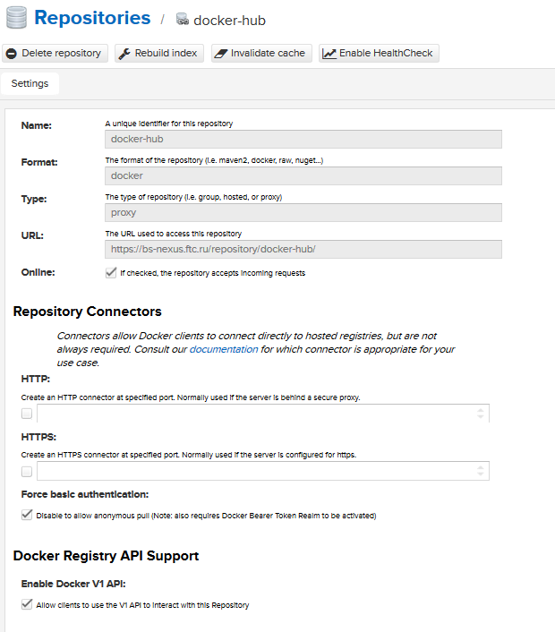
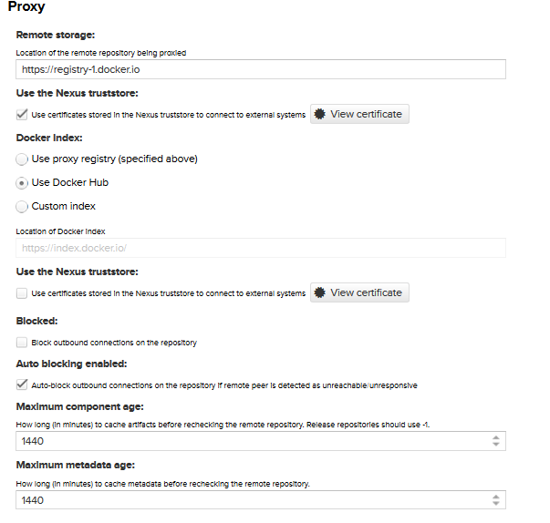
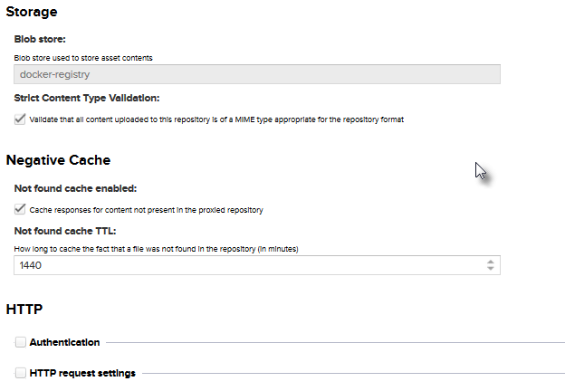
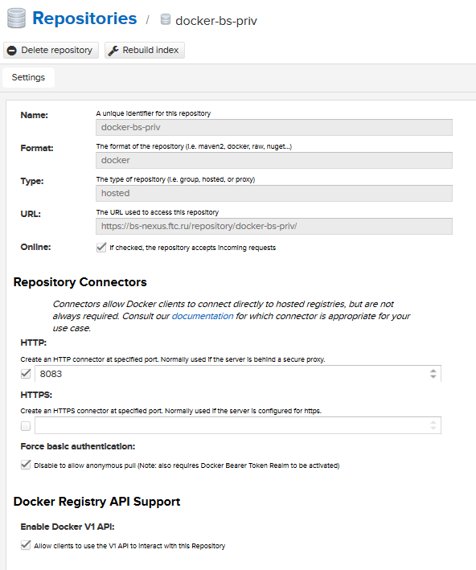
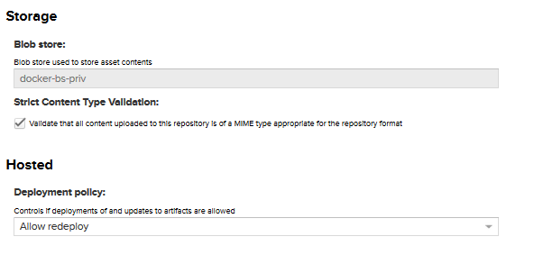
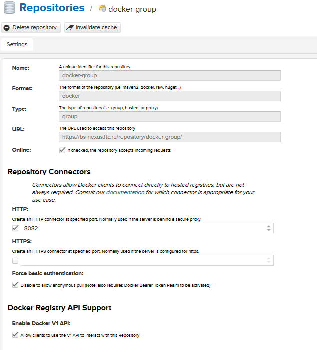
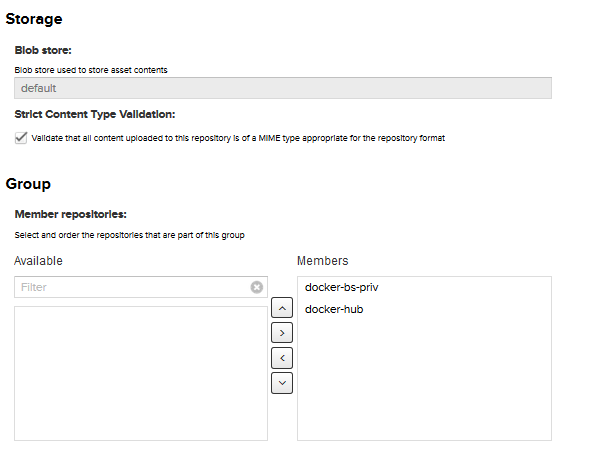
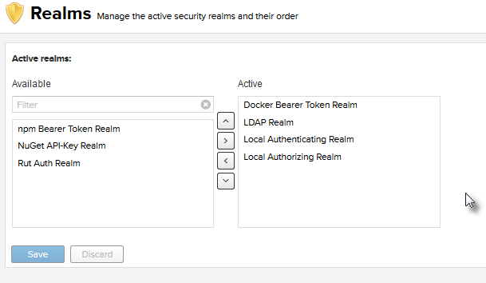
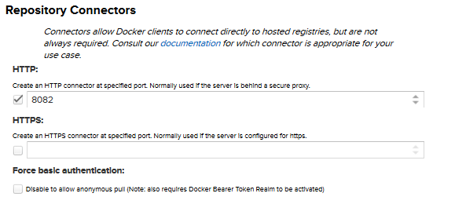

# Как устанавливать docker image из Nexus репозитория.

Author: Evgeniy Krasnukhin(e.krasnukhin@cft.ru)

# Настройка docker registry в Nexus

Необходимо создать 3 типа репозитория:

* hosted - для хранения своих образов
* proxy - прокси к registry docker hub 
* group - здесь я объединяю свой приватный и проксирующий. С него и качаю образы, тем самым получаю доступ как к приватным так и к общим. 

## Создание proxy registry

## Создание hosted(private) registry

## Создание group registry

## Настройка анонимного доступа

[Anonymous read Access](https://help.sonatype.com/repomanager3/private-registry-for-docker/authentication)

Для того, чтобы заработал анонимный доступ. Нужно в Realms добавить  Docker Bearer Token Realm

И убрать галочку в настройках репозитория

# Установка images c group registry

Group registry агрегирует образы с прокси и со своего приватного registry.

Я настроил reverse прокси для проксирования ssl соединений.

Поэтому для работы docker с данным registry необходимо установить *ca* сертификат в систему и перезапустить docker. 
Подробнее как это сделать в заявке #794
 
Поиск образов
~~~
# docker search bs-nexus.ftc.ru:8082/postgresql                                                                                                                                                                                              
INDEX     NAME                                                           DESCRIPTION                                     STARS     OFFICIAL   AUTOMATED                                                                                      
ftc.ru    bs-nexus.ftc.ru:8082/postgres                                  The PostgreSQL object-relational database ...   5003      [OK]                                                                                                      
ftc.ru    bs-nexus.ftc.ru:8082/sameersbn/postgresql                                                                      130                  [OK]                                                                                           
ftc.ru    bs-nexus.ftc.ru:8082/paintedfox/postgresql                     A docker image for running Postgresql.          77                   [OK]                                                                                           
ftc.ru    bs-nexus.ftc.ru:8082/orchardup/postgresql                      https://github.com/orchardup/docker-postgr...   44                   [OK]                                                                                           
ftc.ru    bs-nexus.ftc.ru:8082/centos/postgresql-96-centos7              PostgreSQL is an advanced Object-Relationa...   19                                                                                                                  
ftc.ru    bs-nexus.ftc.ru:8082/bitnami/postgresql                        Bitnami PostgreSQL Docker Image                 18                   [OK]                                                                                           
ftc.ru    bs-nexus.ftc.ru:8082/paunin/postgresql-cluster-pgsql           !!! DEPRECATED !!! use - https://hub.docke...   18                   [OK]                                                                                           
ftc.ru    bs-nexus.ftc.ru:8082/paunin/postgresql-cluster-pgpool          !!! DEPRECATED !!! use - https://hub.docke...   17                   [OK]                                                                                           
ftc.ru    bs-nexus.ftc.ru:8082/centos/postgresql-94-centos7              PostgreSQL is an advanced Object-Relationa...   15                                                                                                                  
ftc.ru    bs-nexus.ftc.ru:8082/wnameless/postgresql-phppgadmin           postgresql + phpPgAdmin https://index.dock...   14                   [OK]                                                                                           
ftc.ru    bs-nexus.ftc.ru:8082/xcgd/postgresql                           The PostgreSQL object-relational database ...   11                   [OK]                                                                                           
ftc.ru    bs-nexus.ftc.ru:8082/centos/postgresql                         Postgresql on CentOS 7                          9                                                                                                                   
ftc.ru    bs-nexus.ftc.ru:8082/zaiste/postgresql                         PostgreSQL 9.2 - https://gist.github.com/z...   8                                                                                                                   
ftc.ru    bs-nexus.ftc.ru:8082/revolucija/centos7-postgresql9.4-django   Dockerfile to build PostgreSQL 9.4 and Dja...   7                                                                                                                   
ftc.ru    bs-nexus.ftc.ru:8082/zumbrunnen/postgresql                     Simple PostgreSQL server, based on Ubuntu.      7                    [OK]                                                                                           
ftc.ru    bs-nexus.ftc.ru:8082/centos/postgresql-95-centos7              PostgreSQL is an advanced Object-Relationa...   5                                                                                                                   
ftc.ru    bs-nexus.ftc.ru:8082/jbergknoff/postgresql-client                                                              5                    [OK]                                                                                           
ftc.ru    bs-nexus.ftc.ru:8082/kamui/postgresql                          PostgreSQL 9.3 with configurable login/dat...   5                    [OK]                                                                                           
ftc.ru    bs-nexus.ftc.ru:8082/tozd/postgresql                           PostgreSQL Docker image.                        5                    [OK]                                                                                           
ftc.ru    bs-nexus.ftc.ru:8082/tobi312/rpi-postgresql                    PostgreSQL on Raspberry Pi / armhf (a port...   4                    [OK]                                                                                           
ftc.ru    bs-nexus.ftc.ru:8082/camptocamp/postgresql                     Camptocamp PostgreSQL Docker Image              3                    [OK]                                                                                           
ftc.ru    bs-nexus.ftc.ru:8082/centurylink/postgresql                                                                    3                    [OK]                                                                                           
ftc.ru    bs-nexus.ftc.ru:8082/ckan/postgresql                           PostgreSQL image for CKAN                       3                    [OK]                                                                                           
ftc.ru    bs-nexus.ftc.ru:8082/frodenas/postgresql                       A Docker Image for PostgreSQL                   3                    [OK]                                                                                           
ftc.ru    bs-nexus.ftc.ru:8082/tutum/postgresql                          Base docker image to run a PostgreSQL data...   3
~~~
 
В *fedora* можно добавить свой registry в файл /etc/containers/registries.conf
~~~
# cat /etc/containers/registries.conf
# This is a system-wide configuration file used to
# keep track of registries for various container backends.
# It adheres to TOML format and does not support recursive
# lists of registries.

# The default location for this configuration file is /etc/containers/registries.conf.

# The only valid categories are: 'registries.search', 'registries.insecure', 
# and 'registries.block'.

[registries.search]
registries = ['bs-nexus.ftc.ru:8082','docker.io', 'registry.fedoraproject.org', 'registry.access.redhat.com']

# If you need to access insecure registries, add the registry's fully-qualified name.
# An insecure registry is one that does not have a valid SSL certificate or only does HTTP.
[registries.insecure]
registries = []

# If you need to block pull access from a registry, uncomment the section below
# and add the registries fully-qualified name.
#
# Docker only
[registries.block]
registries = []

~~~

Тогда по умолчанию наш репозиторий будет в списке.

