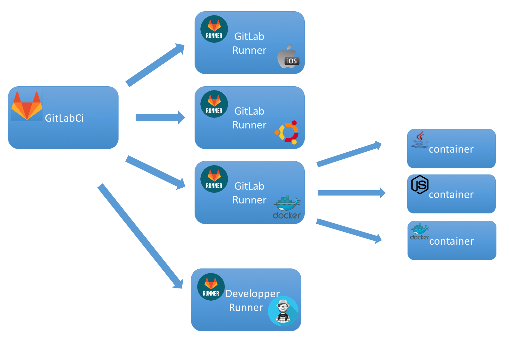
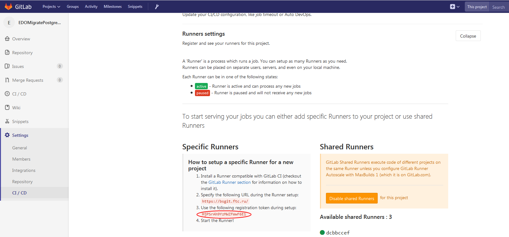
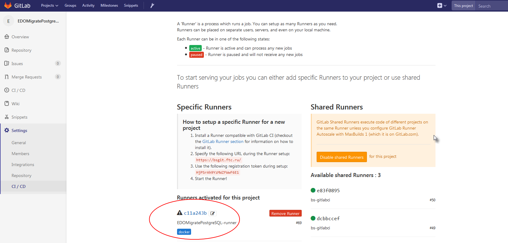
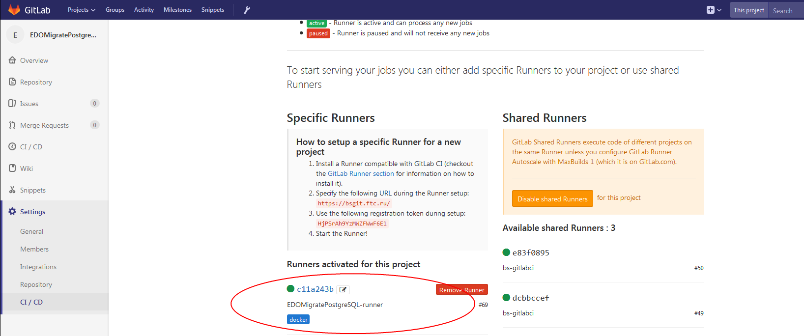

# Установка gitlab-runner in docker

Author: Evgeniy Krasnukhin(e.krasnukhin@cft.ru)

Необходимо: Для проекта в gitlab [EDOMigratePostgreSQL](https://bsgit.ftc.ru/different/EDOMigratePostgreSQL) установить gitlab-runner в докере для сборок, отладок. 

Ниже пример, как поставить docker-runner в докере на хосте service-bs-02. На хосте уже установлен docker-engine. Об установке docker engine есть отдельная статья.

## Немного теории о runner-ах.

GitLab CI/CD позволяет использовать Docker Engine, чтобы билдить и тестировать проекты, построенные на докере.

CI/Deployment позволяет:
1. Забилдить(собрать) образ контейнера
2. Запустить тесты, на собранном образе
3. Отправить образ в репозиторий
4. Задеплоить из собранного образа

Пример докер команд, соответствующие описанным шагам:
~~~
docker build -t my-image dockerfiles/
docker run my-docker-image /script/to/run/tests
docker tag my-image my-registry:5000/my-image
docker push my-registry:5000/my-image
~~~

Для реализации таких задач требуется специальная конфигурация GitLab Runner для поддержки докеров.

GitLab Runner — это агент, который занимается выполнением инструкций из специального файла .gitlab-ci.yml и запуском непосредственно команд(например описанных выше),
т.е. агент, получает задачи от GitLab и выполняет их script.

Есть  3 варианта конфигурации для сбора образов и запуска контейнеров. Более подробно о каждом можно прочитать тут [Building Docker images with GitLab CI/CD](https://docs.gitlab.com/ee/ci/docker/using_docker_build.html) 

Ниже приведен пример настройки ранера в докере и использования специального образа dind (docker-in-docker). Т.е. в докере будет запускать другой докер контейнер, который и будет осуществлять 
сборку и отправку образов.

## Регистрация runner

После этого необходимо зарегистрировать контейнер. [Register the Runner](https://docs.gitlab.com/runner/register/index.html#docker)

В ссылке , указанной выше приводится пример как зарегистрировать runner в интерактивном режиме, но можно передать все параметры сразу, как указано тут [Use docker in docker executor](https://docs.gitlab.com/ee/ci/docker/using_docker_build.html#use-docker-in-docker-executor) , как я и сделал.

Для регистрации потребуется token. Необходимо зайти в проект в gitlab -> Settings-> CI/CD ->Runner Settings и там найти token. Подробнее на рисунке

После того, как посмотрели token, выполнить.

~~~
docker run --rm -t -i -v /root/vho-msa/gitlab-runner/config:/etc/gitlab-runner -v /root/vho-msa/certs/ca:/etc/gitlab-runner/certs --name gitlab-runner bs-nexus.ftc.ru:8082/gitlab/gitlab-runner register \
  --non-interactive \
  --executor "docker" \
  --docker-image docker:stable \
  --url "https://bsgit.ftc.ru/" \
  --registration-token "HjPSrAh9YzMWZFWwF6E1" \
  --description "EDOMigratePostgreSQL-runner" \
  --tag-list "docker" \
  --run-untagged \
  --locked="false" \
  --docker-privileged \
  --docker-disable-cache="false" \
  --docker-tlsverify="false" \
  --cache-s3-insecure="false" 

~~~

Вывод:
~~~
Updating CA certificates...
Running in system-mode.                            
                                                   
Registering runner... succeeded                     runner=HjPSrAh9
Runner registered successfully. Feel free to start it, but if it's running already the config should be automatically reloaded!
~~~

После этого в /root/vho-msa/gitlab-runner/config сформировался конфиг config.toml.
~~~
concurrent = 1
check_interval = 0

[[runners]]
  name = "EDOMigratePostgreSQL-runner"
  url = "https://bsgit.ftc.ru/"
  token = "c11a243bd192491ebdb46aedb6a5f0"
  executor = "docker"
  [runners.docker]
    tls_verify = false
    image = "docker:stable"
    privileged = true
    disable_cache = false
    volumes = ["/cache"]
    shm_size = 0
  [runners.cache]
~~~

Теперь в проекте в разделе Settings->CI/CD->Runners Settings должен появиться не активный runner

Для gitlab-runner добавим в docker-compose.yml
~~~
  gitlab-runner-01:
    image: ${NEXUS_DOCKER_GROUP}/gitlab/gitlab-runner:latest
    volumes:
      - ./gitlab-runner/config:/etc/gitlab-runner
      - /var/run/docker.sock:/var/run/docker.sock
      - ./certs/ca:/etc/gitlab-runner/certs
    restart: always
~~~
После этого запускаю runner c помощью docker-compose
~~~
[root@service-bs-02 vho-msa]# docker-compose up -d gitlab-runner-01
Creating vho-msa_gitlab-runner-01_1 ... done
[root@service-bs-02 vho-msa]# docker-compose logs gitlab-runner-01
Attaching to vho-msa_gitlab-runner-01_1
gitlab-runner-01_1   | Updating CA certificates...
gitlab-runner-01_1   | Starting multi-runner from /etc/gitlab-runner/config.toml ...  builds=0
gitlab-runner-01_1   | Running in system-mode.                            
gitlab-runner-01_1   |                                                    
gitlab-runner-01_1   | Configuration loaded                                builds=0
gitlab-runner-01_1   | Metrics server disabled
~~~

После этого runner должен стать активным.

Настройка runner-a завершена. 

Пример  .gitlab-ci.yml
~~~
image: bs-nexus.ftc.ru:8082/docker:stabel

variables:
  GIT_SSL_NO_VERIFY: "true"

services:
  - bs-nexus.ftc.ru:8082/docker:dind

stages:
  - test

test_job:
  stage: test
  script:
    - echo "test"
  tags:
    - docker
  only:
    - develop
~~~
Более подробного о том как правильно писать *.gitlab-ci.yml* тут [Making docker-in-docker builds faster with Docker layer caching](https://docs.gitlab.com/ee/ci/docker/using_docker_build.html#making-docker-in-docker-builds-faster-with-docker-layer-caching)