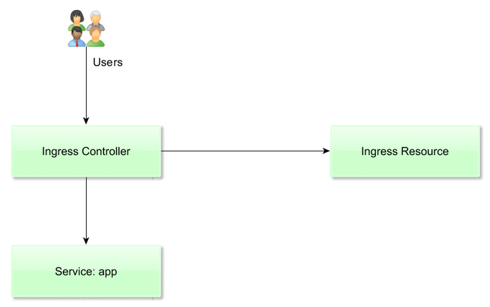
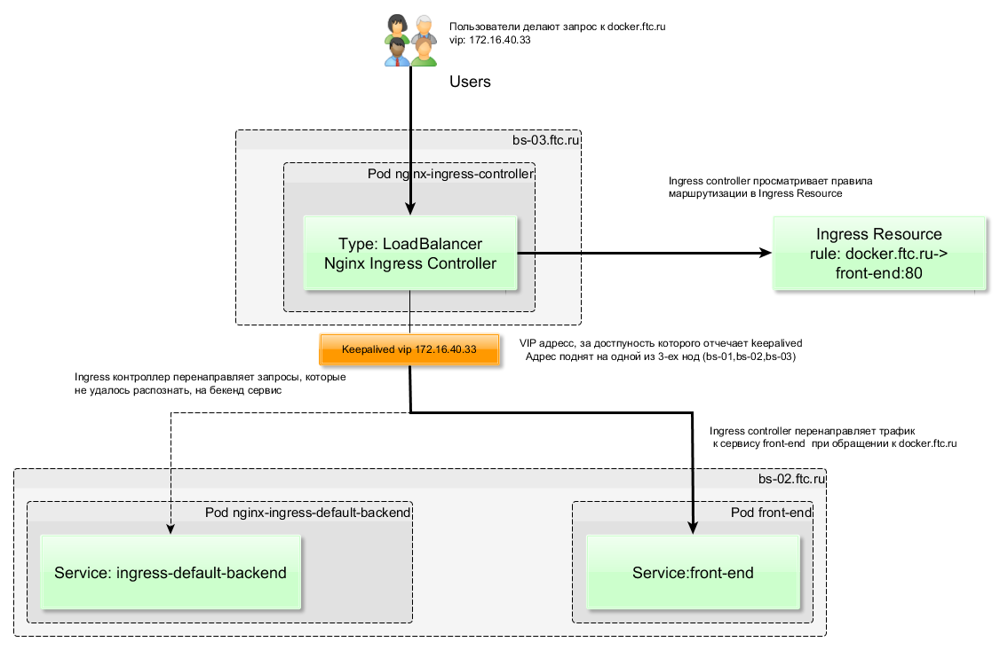

# Установка ingress в k8s

Author: Evgeniy Krasnukhin(e.krasnukhin@cft.ru)

Полезные ссылки:
**[Ingress with NGINX controller on Google Kubernetes Engine](https://cloud.google.com/community/tutorials/nginx-ingress-gke)**
**[Kubernetes: использование Ingress](https://dev-ops-notes.ru/kubernetes/kubernetes-%D0%B8%D1%81%D0%BF%D0%BE%D0%BB%D1%8C%D0%B7%D0%BE%D0%B2%D0%B0%D0%BD%D0%B8%D0%B5-ingress/)**

# Архитектура Ingress

В Kubernetes, **Ingress** позволяет получить доступ к HTTP сервисам.

Ingress состоит из 2-ух компонент:
1. **Ingress Resource**
2. **Ingress Controller**
 
**Ingress Resource** - это набор правил внутри кластера Kubernetes, предназначенных для того, чтобы входящие подключения могли достичь сервисов (Services)приложений.

**Ingress Controller** - это балансировщик, который перенаправляет трафик до сервисов(Services) приложений в соответствии с правилами,  описанными в Ingress Resource. 

*Ingress Controller* представляет собой ни что иное, как отдельный Pod с установленным в него Nginx, Traefik или другим балансировщиком.   

Основные задачи, которые решает Ingress:

* Организация для ваших приложений внешне доступных URL
* Обеспечение балансировки трафика
* Терминация SSL
* Виртуальный хостинг на основе имен и т.д

Описанная архитектура в виде диаграммы:



# Установка Ingress-а

В качестве Ingress Controller-a я буду использовать **[Nginx](https://github.com/helm/charts/tree/master/stable/nginx-ingress)**

В моем кластере настроено тестовое приложение Sock-Shop. У него есть сервис **front-end** для которого я настрою Ingress. 

```
kubectl get svc -n sock-shop -o wide front-end
NAME        TYPE       CLUSTER-IP    EXTERNAL-IP   PORT(S)        AGE       SELECTOR
front-end   NodePort   10.233.2.58   <none>        80:30001/TCP   5d        name=front-end
```
Для публикации сервиса наружу кластера используется функционал [NodePort](https://kubernetes.io/docs/concepts/services-networking/service/#nodeport)
> NodePort: Exposes the service on each Node’s IP at a static port (the NodePort). A ClusterIP service, to which the NodePort service will route, is automatically created. You’ll be able to contact the NodePort service, from outside the cluster, by requesting \<NodeIP\>:\<NodePort\>.

Pod *front-end-679d7bcb77-45hhm* находится на ноде bs-01
~~~
kubectl get pods -n sock-shop -o wide front-end-679d7bcb77-45hhm
NAME                         READY     STATUS    RESTARTS   AGE       IP             NODE
front-end-679d7bcb77-45hhm   1/1       Running   0          5d        10.233.65.12   bs-01
~~~

Соответственно тестовое приложение sock-shop доступно по адресу http://bs-01.ftc.ru:30001. Это совершенно неудобно,

т.к. при таком подходе придеться использовать внешний балансировщик трафика и держать на нем в актуальном состоянии список

всех вычислительных хостов(нод) кластера, а также список актуальных опубликованных приложений. Для публикации приложения буду использовать Ingress.

## Установка Ingress Controller-а

Ниже представлен пример реализации архитектурной схемы:


### Установка с помощью **Helm**

Для  удобства, я воcпользовался Helm.

На github https://github.com/helm/charts/tree/master/stable/nginx-ingress скачал файл values.yaml

Добавил адрес 172.16.40.33 в **externalIPs** (О значении параметров можно посмотреть на github.)
~~~
externalIPs: [172.16.40.33]
~~~

172.16.40.33 - это VIP адрес. За доступность которого отвечает сервис keepalived.
О настройке keepalived можно прочитать в статье **[Настройка Kubernetes Virtual IP с помощью keepalived](https://bftman.ftc.ru/boards/13/topics/43-nastroyka-kubernetes-virtual-ip-s-pomoschyu-keepalived)**

Устанавливаю чарт *stable/nginx-ingress* с именем my-release
~~~
#helm install stable/nginx-ingress --name my-release -f values.yaml                                                                                                                                                         
NAME:   my-release                                                                                                                                                                                                                           
LAST DEPLOYED: Thu Aug  2 15:19:58 2018                                                                                                                                                                                                      
NAMESPACE: default                                                                                                                                                                                                                           
STATUS: DEPLOYED                                                                                                                                                                                                                             
                                                                                                                                                                                                                                             
RESOURCES:                                                                                                                                                                                                                                   
==> v1beta1/RoleBinding                                                                                                                                                                                                                      
NAME                      AGE                                                                                                                                                                                                                
my-release-nginx-ingress  0s                                                                                                                                                                                                                 
                                                                                                                                                                                                                                             
==> v1/Service                                                                                                                                                                                                                               
NAME                                      TYPE          CLUSTER-IP    EXTERNAL-IP   PORT(S)                     AGE                                                                                                                          
my-release-nginx-ingress-controller       LoadBalancer  10.233.8.63   172.16.40.33  80:30389/TCP,443:32209/TCP  0s                                                                                                                           
my-release-nginx-ingress-default-backend  ClusterIP     10.233.3.212  <none>        80/TCP                      0s                                                                                                                           
                                                                                                                                                                                                                                             
==> v1/Pod(related)                                                                                                                                                                                                                          
NAME                                                       READY  STATUS             RESTARTS  AGE                                                                                                                                           
my-release-nginx-ingress-controller-566bd6ff59-7bq4q       0/1    ContainerCreating  0         0s                                                                                                                                            
my-release-nginx-ingress-default-backend-7fc47f9c79-hdwxx  0/1    ContainerCreating  0         0s                                                                                                                                            
                                                                                                                                                                                                                                             
==> v1/ConfigMap                                                                                                                                                                                                                             
NAME                                 DATA  AGE                                                                                                                                                                                               
my-release-nginx-ingress-controller  1     0s                                                                                                                                                                                                
                                                                                                                                                                                                                                             
==> v1beta1/ClusterRole                                                                                                                                                                                                                      
NAME                      AGE                                                                                                                                                                                                                
my-release-nginx-ingress  0s                                                                                                                                                                                                                 
                                                                                                                                                                                                                                             
==> v1beta1/ClusterRoleBinding                                                                                                                                                                                                               
NAME                      AGE                                                                                                                                                                                                                
my-release-nginx-ingress  0s                                                                                                                                                                                                                 
                                                                                                                                                                                                                                             
==> v1beta1/PodDisruptionBudget                                                                                                                                                                                                              
NAME                                      MIN AVAILABLE  MAX UNAVAILABLE  ALLOWED DISRUPTIONS  AGE                                                                                                                                           
my-release-nginx-ingress-controller       1              N/A              0                    0s                                                                                                                                            
my-release-nginx-ingress-default-backend  1              N/A              0                    0s

==> v1/ServiceAccount
NAME                      SECRETS  AGE
my-release-nginx-ingress  1        0s

==> v1beta1/Role
NAME                      AGE
my-release-nginx-ingress  0s

==> v1beta1/Deployment
NAME                                      DESIRED  CURRENT  UP-TO-DATE  AVAILABLE  AGE
my-release-nginx-ingress-controller       1        1        1           0          0s
my-release-nginx-ingress-default-backend  1        1        1           0          0s


NOTES:
The nginx-ingress controller has been installed.
It may take a few minutes for the LoadBalancer IP to be available.
You can watch the status by running 'kubectl --namespace default get services -o wide -w my-release-nginx-ingress-controller'

An example Ingress that makes use of the controller:

  apiVersion: extensions/v1beta1
  kind: Ingress
  metadata:
    annotations:
      kubernetes.io/ingress.class: nginx
    name: example
    namespace: foo
  spec:
    rules:
      - host: www.example.com
        http:
          paths:
            - backend:
                serviceName: exampleService
                servicePort: 80
              path: /
    # This section is only required if TLS is to be enabled for the Ingress
    tls:
        - hosts:
            - www.example.com
          secretName: example-tls

If TLS is enabled for the Ingress, a Secret containing the certificate and key must also be provided:


  apiVersion: v1
  kind: Secret
  metadata:
    name: example-tls
    namespace: foo
  data:
    tls.crt: <base64 encoded cert>
    tls.key: <base64 encoded key>
  type: kubernetes.io/tls

~~~

Обратите внимание, что во время установки было создано 2 сервиса 
1. **my-release-nginx-ingress-controller**
2. **my-release-nginx-ingress-default-backend**

Для работы **IngressController-а** необходимо наличие бекенда по-умолчанию, который предназначен для отдачи 404 ошибки на неизвестные запросы.
my-release-nginx-ingress-default-backend  обрабатывает все запросы которые NGINX controller не смог распознать,
т.е. все запросы к которым не было найдено правил в Ingress Resource-е. 
backend обрабатывает 2 URLs:
* /healthz - возвращает 200
* /  - возвращает 404 

## Конфигурация Ingreess Resource-а

Я создал Ingress Resource из файла *ingress-sockes.yaml*:

~~~ yaml
apiVersion: extensions/v1beta1
kind: Ingress
metadata:
  annotations:
    kubernetes.io/ingress.class: nginx
  name: front-end
  namespace: sock-shop
spec:
  rules:
  - host: docker.ftc.ru
    http:
      paths:
      - path: /
        backend:
          serviceName: front-end
          servicePort: 80
~~~

docker.ftc.ru - по этому адресу будет доступно приложение Socks-Shop. Для тестового примера я не стал заводить специальный адрес,
а воспользовался зарезирвированным.

Проверить, что *ingress resource* создался
~~~
#kubectl get ingress -n sock-shop
NAME        HOSTS           ADDRESS   PORTS     AGE
front-end   docker.ftc.ru             80        3d
~~~

Пояле этого, можно проверить доступность сервиса.

~~~
$ curl -I docker.ftc.ru
HTTP/1.1 200 OK
Server: nginx/1.13.12
Date: Mon, 06 Aug 2018 08:05:05 GMT
Content-Type: text/html; charset=UTF-8
Content-Length: 8688
Connection: keep-alive
Vary: Accept-Encoding
X-Powered-By: Express
Accept-Ranges: bytes
Cache-Control: public, max-age=0
Last-Modified: Tue, 21 Mar 2017 11:31:47 GMT
ETag: W/"21f0-15af0a320b8"
~~~

Код ответа 200. Но лучше открыть приложение прямо в браузере.

