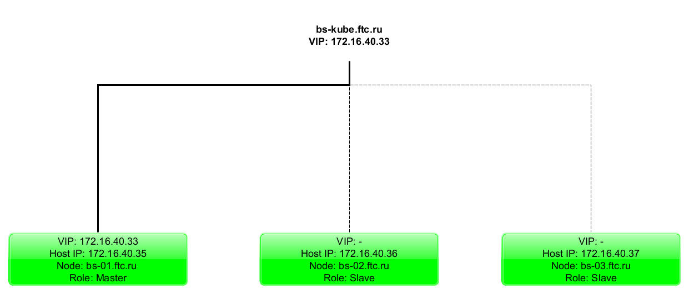
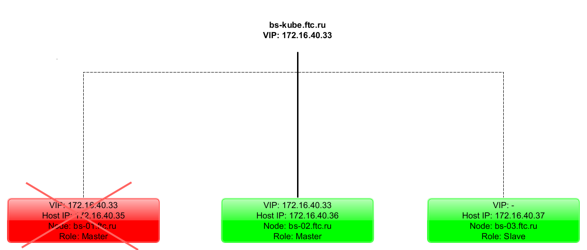

# Настройка Kubernetes Virtual IP c помощью keepalived

Author: Evgeniy Krasnukhin(e.krasnukhin@cft.ru)

# kube-keepalived-vip

Проект на github **[kube-keepalived-vip](https://github.com/kubernetes/contrib/tree/master/keepalived-vip)**

## Немного теории. Зачем вообще нужен Keepalived.

Мне был необходим VIP для loadbalancer(nginx). Для балансировки я буду использовать Ingress, чтобы перенаправлять http/https трафик.

У меня есть 3 ноды кластера kubernetes bs-01.ftc.ru(172.16.40.35),bs-02.ftc.ru(172.16.40.36), bs-03.ftc.ru(172.16.40.37). 

Есть Ingress, который может быть запущен  на любой из 3-ех нод. Адрес ingress не должен меняться при отказе одной и более нод, ему должен быть присвоен адрес 172.16.40.33 - это и есть vip адрес. 

KEEPALIVED  служит дополнением к nginx. Его цель обеспечивать доступность vip адреса при падение одной или более нод.

В случае падения одной из нод, VIP адрес будет назначен любой другой доступной ноде и она станет мастером. Поэтому bs-kube.ftc.ru останется доступным по адресу 172.16.40.33. Схематически это выглядит так.

## Установка

Клонирую репозиторий.
~~~
#git clone https://github.com/kubernetes/contrib
~~~
Клонировать весь *contrib* необязательно, достаточно стянуть только *keepalived-vip*
### Настройка RBAC

Поскольку в настроенном кластере управление доступом построено но основе ролей (RBAC), то необходимо создать пользователя и выдать соответствующие права.

Необходимо создать сервисную учетку, чтобы *keepalived* получил доступ к **kube-apiserver**.

~~~ 
#kubectl create sa kube-keepalived-vip
~~~

После этого необходимо создать **ClusterRole** и дать права сервисной учетке *kube-keepalived-vip* на получение информации об объектах кластера: *pods, nodes,endpoints, services, configmaps*.
~~~
#echo 'apiVersion: rbac.authorization.k8s.io/v1alpha1
kind: ClusterRole
metadata:
  name: kube-keepalived-vip
rules:
- apiGroups: [""]
  resources:
  - pods
  - nodes
  - endpoints
  - services
  - configmaps
  verbs: ["get", "list", "watch"]' | kubectl create -f -
~~~
Далее необходимо привязать **ClusterRole** **kube-keepalived-vip** к субъекту **ServiceAccount** **kube-keepalived-vip**.

Для этого нужно создать **ClusterRoleBindings**(связь кластерных ролей) для применения прав, указанных в **ClusterRole** **kube-keepalived-vip** 
~~~
#echo 'apiVersion: rbac.authorization.k8s.io/v1alpha1
kind: ClusterRoleBinding
metadata:
  name: kube-keepalived-vip
roleRef:
  apiGroup: rbac.authorization.k8s.io
  kind: ClusterRole
  name: kube-keepalived-vip
subjects:
- kind: ServiceAccount
  name: kube-keepalived-vip
  namespace: default ' | kubectl create -f -
~~~
### Создание ***keepalived*** DaemonSet

Необходимо создать ConfigMap для конфигурации vip.
Текст vip-configmap.yaml:
~~~ yaml
apiVersion: v1
kind: ConfigMap
metadata:
  name: vip-configmap
data:
  172.16.40.33: ''
~~~
~~~
#kubectl create -f vip-configmap.yaml
~~~

Обратите внимание, что после адреса 172.168.40.33 пусто, нужно указывать обязательно кавычки, иначе будет ошибка.
Данный адрес будет использовать **Ingress**.

Про конфигурацию **ConfigMap** написано на github проекта:

>To expose one or more services use the flag services-configmap. The format of the data is: external IP -> namespace/serviceName. Optionally it is possible to specify forwarding method using : after the service name. The valid options are NAT and DR. For instance external IP -> namespace/serviceName:DR. By default, if the method is not specified it will use NAT. If the service name is left blank, only the VIP will be assigned and no routing will be done. This is useful e.g. if you run HAProxy in another pod on the same machines with hostnetwork in order to forward incoming smtp requests via proxy protocol to postfix.

>This IP must be routable within the LAN and must be available. By default the IP address of the pods is used to route the traffic. This means that is one pod dies or a new one is created by a scale event the keepalived configuration file will be updated and reloaded.

Я пока настроил только один адрес, так что остальное не проверял.

Необходимо добавить сервисную учетку в файле конфигурации **DaemonSet** ***vip-daemonset.yaml***. Необходимо добавить строчку `serviceAccount: kube-keepalived-vip`
~~~ yaml
   spec:
      hostNetwork: true
      serviceAccount: kube-keepalived-vip
      containers:
~~~

Так же я закомментировал раздел *nodeSelector* поскольку пока у меня ноды равнозначны.
~~~
#kubectl create -f vip-daemonset.yaml
daemonset "kube-keepalived-vip" created
#kubectl get daemonset -o wide
NAME                  DESIRED   CURRENT   READY     UP-TO-DATE   AVAILABLE   NODE SELECTOR   AGE       CONTAINERS            IMAGES                                SELECTOR
kube-keepalived-vip   3         3         3         3            3           <none>          1d        kube-keepalived-vip   k8s.gcr.io/kube-keepalived-vip:0.11   name=kube-keepalived-vip
~~~

### Проверка работоспособности
Первым делом необходимо убедиться, что pod ***kube-keepalived-vip*** запущен на всех нодах кластера
~~~
#kubectl get pods -o wide
NAME                                                        READY     STATUS    RESTARTS   AGE       IP             NODE
kube-keepalived-vip-bcsrd                                   1/1       Running   0          1d        172.16.40.36   bs-02
kube-keepalived-vip-lztf5                                   1/1       Running   1          1d        172.16.40.35   bs-01
kube-keepalived-vip-skts9                                   1/1       Running   0          1d        172.16.40.37   bs-03
~~~
Лог ***keepalived*** должен выглядить вот так
~~~
#kubectl logs kube-keepalived-vip-bcsrd
Starting Keepalived v1.2.24 (08/01,2017)
Opening file '/etc/keepalived/keepalived.conf'.
Starting Healthcheck child process, pid=24
Starting VRRP child process, pid=25
Initializing ipvs
Registering Kernel netlink reflector
Registering Kernel netlink command channel
Opening file '/etc/keepalived/keepalived.conf'.
Registering Kernel netlink reflector
Registering Kernel netlink command channel
Registering gratuitous ARP shared channel
Opening file '/etc/keepalived/keepalived.conf'.
Using LinkWatch kernel netlink reflector...
Using LinkWatch kernel netlink reflector...
Opening file '/etc/keepalived/keepalived.conf'.
Got SIGHUP, reloading checker configuration
Initializing ipvs
Registering Kernel netlink reflector
Registering Kernel netlink command channel
Opening file '/etc/keepalived/keepalived.conf'.
Using LinkWatch kernel netlink reflector...
Registering Kernel netlink reflector
Registering Kernel netlink command channel
Registering gratuitous ARP shared channel
Opening file '/etc/keepalived/keepalived.conf'.
Using LinkWatch kernel netlink reflector...
VRRP_Instance(vips) Entering BACKUP STATE
~~~
После старта подов конфиг пустой. Но если мы создали **ConfigMap**, то конфиг будет обновлен автоматически. В контейнере есть бинарник, написанный на

go который как-то опрашивает API server и при правильной конфигурации ConfigMap-а генерирует конфиг из шаблона.

Посмотреть сконфигурированный конфиг:
~~~
# kubectl get pods
NAME                                                        READY     STATUS    RESTARTS   AGE
kube-keepalived-vip-bcsrd                                   1/1       Running   0          1d
kube-keepalived-vip-lztf5                                   1/1       Running   1          1d
kube-keepalived-vip-skts9                                   1/1       Running   0          1d
my-release-nginx-ingress-controller-566bd6ff59-7bq4q        1/1       Running   0          21h
my-release-nginx-ingress-default-backend-7fc47f9c79-hdwxx   1/1       Running   0          21h

# kubectl exec kube-keepalived-vip-bcsrd cat /etc/keepalived/keepalived.conf

global_defs {
  vrrp_version 3
  vrrp_iptables KUBE-KEEPALIVED-VIP
}

vrrp_instance vips {
  state BACKUP
  interface eth0
  virtual_router_id 50
  priority 104
  nopreempt
  advert_int 1

  track_interface {
    eth0
  }

  

  virtual_ipaddress { 
    172.16.40.33
  }
}

# VIP Service with no pods: 172.16.40.33
~~~    

После этого можно пингануть VIP адрес и при правильной конфигурации он должен ответить
~~~
# ping 172.16.40.33 -c 4
PING 172.16.40.33 (172.16.40.33) 56(84) bytes of data.
64 bytes from 172.16.40.33: icmp_seq=1 ttl=64 time=0.198 ms
64 bytes from 172.16.40.33: icmp_seq=2 ttl=64 time=0.168 ms
64 bytes from 172.16.40.33: icmp_seq=3 ttl=64 time=0.164 ms
64 bytes from 172.16.40.33: icmp_seq=4 ttl=64 time=0.232 ms

--- 172.16.40.33 ping statistics ---
4 packets transmitted, 4 received, 0% packet loss, time 2999ms
rtt min/avg/max/mdev = 0.164/0.190/0.232/0.030 ms
~~~

На этом настройка завершена. Далее читайте про настройку Ingress.