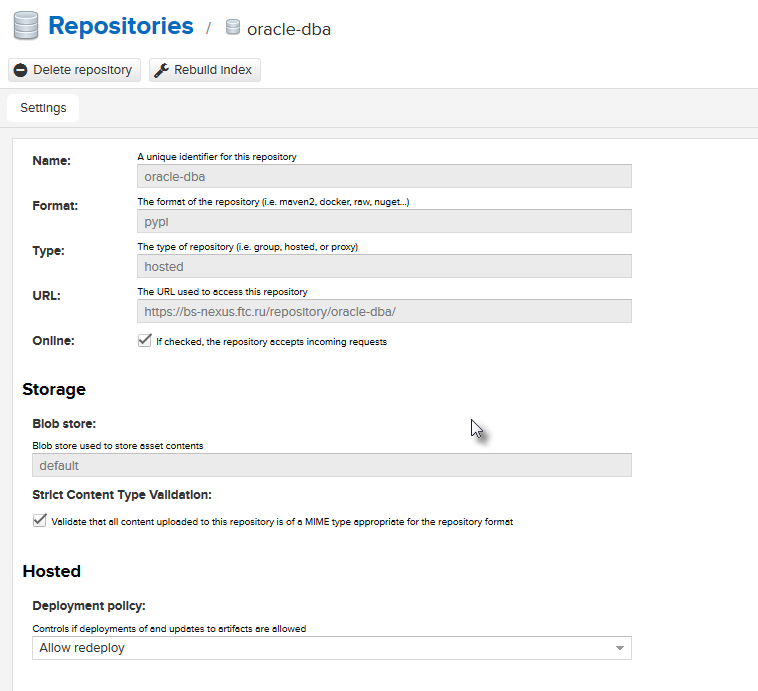
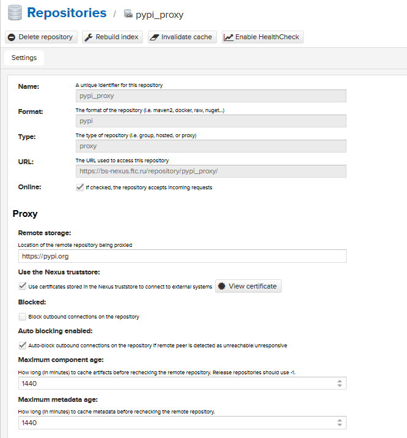
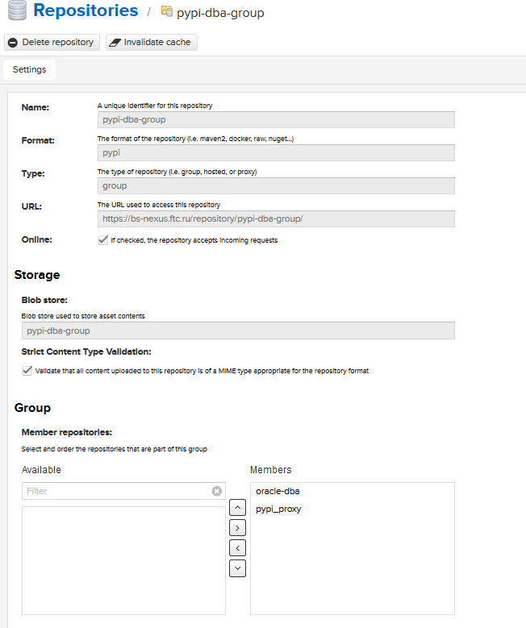

# Как заливать/устанавливать пакеты в pypi репозиторий Nexus-а. 

# Создание pypi репозитория в NEXUS.

Официальная дока [PyPI Repositories](https://help.sonatype.com/repomanager3/pypi-repositories)

Необходимо создать 3 репозитория.
* Hosted - для зранения собственных пакетов
* Proxy  - проксирующий с pypi.org
* Group - аггрегирующий. В него будут входить hosted и group. С него можно ставить пакеты pip-ом. 

## Создание hosted(приватного) репозитория

Создать hosted репозиторий просто. Hosted - т.е. приватный, для хранения своих проектов.
Необходимо в админке Nexus выбрать

Repositories->Create repository->pypi(hosted)

## Создать proxy репозиторий

## Создать group репозиторий

# Upload artifacts

Заливка артифактов. 

Создать файл *~/.pypirc*
~~~
[distutils]                                                                                                                                                                                                                                  
index-servers =
     oracle-dba

[oracle-dba]
repository:https://bs-nexus.ftc.ru/repository/oracle-dba/
username:admin
password:admin123
~~~

Выбрать механизм заливки.
Тут есть несколько вариантов:
* twine - утилита  с помощью которой можно залить пакеты
* python setup upload

## twine

~~~
$ . ~/ora/bin/activate
$ pip install twine
~~~

Добавить в файл *`/home/oracle/ora/lib/python2.7/site-packages/certifi/cacert.pem`* информацию о корневом сертифкате,
В данном пример `vertualenv=/home/oracle/ora`

Информация о нашем CA
~~~
# Issuer: CN=ckca.ftc.ru
# Subject: CN=ckca.ftc.ru
# SHA1 Fingerprint: BB:31:D1:6E:FF:60:8D:59:AB:2A:E0:07:54:40:4D:78:6F:89:74:6B
# SHA256 Fingerprint: 89:04:E6:2D:14:E4:A6:F5:2D:33:23:AC:F7:1D:CE:05:77:AF:CA:E1:A3:B3:64:30:98:93:E3:64:0F:DA:6B:31
-----BEGIN CERTIFICATE-----
MIIGGDCCBACgAwIBAgIJAOW6iKMEH3HEMA0GCSqGSIb3DQEBCwUAMIGMMQswCQYD
VQQGEwJSVTEbMBkGA1UECAwSTm92b3NpYmlyc2sgUmVnaW9uMRQwEgYDVQQHDAtO
b3Zvc2liaXJzazEMMAoGA1UECgwDQ0ZUMQswCQYDVQQLDAJJVDEUMBIGA1UEAwwL
Y2tjYS5mdGMucnUxGTAXBgkqhkiG9w0BCQEWCmFuYkBjZnQucnUwHhcNMTgwNjA0
MDczNTM0WhcNMjgwNjA1MDczNTM0WjCBjDELMAkGA1UEBhMCUlUxGzAZBgNVBAgM
Ek5vdm9zaWJpcnNrIFJlZ2lvbjEUMBIGA1UEBwwLTm92b3NpYmlyc2sxDDAKBgNV
BAoMA0NGVDELMAkGA1UECwwCSVQxFDASBgNVBAMMC2NrY2EuZnRjLnJ1MRkwFwYJ
KoZIhvcNAQkBFgphbmJAY2Z0LnJ1MIICIjANBgkqhkiG9w0BAQEFAAOCAg8AMIIC
CgKCAgEArIS1DLNcPIO7tkUlyHKVZn1xsIMCS0HGUUAFt0/+5BP7c0fhO2wge22x
whN6SvKIGn24+Syibp2h0yEzeN0h5nMhB4X8RZvws/ixzDY5TpeBsaWlJs6EoAXD
NX2UKSjSgHHYCVZbP9M8BJ5d22FN7S2NBaqLlHyW9JeBvUm1cNKVFIXAqGN5CZDR
G4+9CO/6S5ioybrDiNQWgP4G2k3D4+69WGs4svexaKz74bw7DHeHO+Bf+N9fPKOW
g+NLAXsMrKhfSF55lJdGDscu583W6C0iWkCJlsCUGXfWdwgJHOoai7puuj7r3Bed
cc8Ke5GLa+pBPZbJlurIzwy9i/we6hheF1TMOM4UlZGgoFS0R6QvFJxo9MtRPnHY
Ran1vO1/A+Ua8avKUiGwzZ+YEz/g4NElhpp3+q3rGMaOwqvCY9tTtpjAWWEvXSSX
cgXZH66jIkIBqsbaj6Xeytov3HzGo+FKLqmBx77U8bjltNQylFkWCCdWrXYMR8Z6
BkAEROQf9N/4wHSh0bBqHz0swQWrVlu4CgwhTWB/l2K4G+TpCLjPbuBV1UlyQ7TF
WUW00bjpDAQYOEAhuAMuRhrf5jbFU62GXeyG8YC2naIikhc1DFjFSEMxk8uv30Z5
HNwSWDvLXTr9LrIM+JbShq99QvVYeJgTo1zdUGpWVS3XKMR5CTkCAwEAAaN7MHkw
HQYDVR0OBBYEFJ2/qZ/FM0rpqG8mh4on5xTos18RMB8GA1UdIwQYMBaAFJ2/qZ/F
M0rpqG8mh4on5xTos18RMAwGA1UdEwQFMAMBAf8wKQYDVR0RBCIwIIIEY2tjYYIL
Y2tjYS5mdGMucnWCC2NrY2EuY2Z0LnJ1MA0GCSqGSIb3DQEBCwUAA4ICAQA3WfaC
07zyuzjFGjIG82ndarsXTYQTPQVwJJW/j7OSznUl1TshxcfC+DqO7SYMnmTYvj1Z
Nj9OkK5tm5wvig2cj9+RPaUqTwEXIwKX1t5ofSJW9QHi7iGVU+hwqKl8fhDJv7gJ
qr4jKkBGA1w8E8joWwcd8jnR/H1sgTtBwckWOLpeMFjMVi8Cg9spPZY236I44ptF
XWZHz9TnqMwIQGM+hpZgJ1YsI2BRp9zPni18yVJ/VnNv7/Djdrj002j1RXwTVz1e
QBNIO0dqNFEfTui+jAbEpQ+wfLnNVDeOYCOEEwtKyxxDTz2QELvf1rplnISHT+Qv
JaqGxjJCW/ztO8kS9NfENq+qe9g/7S+9Z6YwB6Cu8YTp+EQXt0MmlwgtsGc7DQ7x
74/eXr2jtBu5iRGbuwO/H6kKGywSm47BOJYfJAUeMHCLAqcZAgxpJIfHqU2fcvj4
zLt90iwcAPJfYcSirOg9zeIE7U5NAwUiUfXyckTnIyMPJmtQVzgxDvIPAZ3apmWH
yncKl43dysOj19roBn5/0zunyCC2vTBqT/e54KWkZ4wxcEjAZPdswupyR1mctOjO
hD5MFPG7KUPyZUbv2GKBsgtu/Mfi8na1KUIVH7/97uEmG/JFKHfWFHCCM9ZZIu3a
UYI/II0dkSsgBtckjKCBLe/zQGfoHt86D6zmAQ==
-----END CERTIFICATE-----
~~~

После этого twine заработал
~~~
$ twine upload -r oracle-dba dist/oracledb-0.1.2.tar.gz 
Uploading distributions to https://bs-nexus.ftc.ru/repository/oracle-dba/
Uploading oracledb-0.1.2.tar.gz
100%|████████████████████████████████████████████████████████████████████████████████████████████████████████████████████████████████████████████████████████████████████████████████████████████████████| 33.4k/33.4k [00:00<00:00, 202kB/s]
~~~

## setup.py upload

Другой вариант собрать и залить с помощью `setup.py upload`.
Корневой сертифкат уже добавлен.

Заливать так:
~~~
$  python setup.py sdist upload -r oracle-dba                                                                                                                                                                                                
running sdist                                                                                                                                                                                                                                
running egg_info                                                                                                                                                                                                                             
writing requirements to oracledb.egg-info/requires.txt                                                                                                                                                                                       
writing oracledb.egg-info/PKG-INFO                                                                                                                                                                                                           
writing top-level names to oracledb.egg-info/top_level.txt                                                                                                                                                                                   
writing dependency_links to oracledb.egg-info/dependency_links.txt                                                                                                                                                                           
reading manifest file 'oracledb.egg-info/SOURCES.txt'                                                                                                                                                                                        
reading manifest template 'MANIFEST.in'                    
writing manifest file 'oracledb.egg-info/SOURCES.txt'      
running check                                              
warning: check: missing required meta-data: url            

creating oracledb-0.1.2                                    
creating oracledb-0.1.2/oracledb                           
creating oracledb-0.1.2/oracledb.egg-info                  
creating oracledb-0.1.2/oracledb/sql                       
creating oracledb-0.1.2/oracledb/templates                 
copying files to oracledb-0.1.2...                         
copying MANIFEST.in -> oracledb-0.1.2                      
copying README.rst -> oracledb-0.1.2                       
copying setup.py -> oracledb-0.1.2
.
.
.
Writing oracledb-0.1.2/setup.cfg                           
Creating tar archive                                       
removing 'oracledb-0.1.2' (and everything under it)        
running upload                                             
Submitting dist/oracledb-0.1.2.tar.gz to https://bs-nexus.ftc.ru/repository/oracle-dba/                               
Server response (200): OK
~~~

## pip install, pip search

Но что странно после добавления корневого сертификата в цепочку ca `pip search/install` ругается на ca
~~~
$ pip search oracledb
Retrying (Retry(total=4, connect=None, read=None, redirect=None, status=None)) after connection broken by 'SSLError(SSLError(1, u'[SSL: CERTIFICATE_VERIFY_FAILED] certificate verify failed (_ssl.c:700)'),)': /repository/oracle-dba/pypi
Retrying (Retry(total=3, connect=None, read=None, redirect=None, status=None)) after connection broken by 'SSLError(SSLError(1, u'[SSL: CERTIFICATE_VERIFY_FAILED] certificate verify failed (_ssl.c:700)'),)': /repository/oracle-dba/pypi
~~~

Создал pip.conf файл в корне `virtualenv /home/oracle/ora/pip.conf`
~~~
[global]                                                                                                                                                                                                                                     
index = https://bs-nexus.ftc.ru/repository/pypi-dba-group/pypi
index-url = https://bs-nexus.ftc.ru/repository/pypi-dba-group/simple
cert = /home/oracle/ora/cacert.pem
~~~

Где `https://bs-nexus.ftc.ru/repository/pypi-dba-group` - это group репозиторий в него входят (pypi-proxy, oracle-dba приватный)

Положил cacert.pem по указанному пути в cert 

После этого search/install заработал
~~~
$ pip search oracledb -v
Starting new HTTPS connection (1): bs-nexus.ftc.ru
https://bs-nexus.ftc.ru:443 "POST /repository/pypi-dba-group/pypi HTTP/1.1" 200 821
oracledb (0.1.2)                 - 
  INSTALLED: 0.1.2 (latest)
robotframework-oracledb (1.0.1)  - Robot Framework library for working with Oracle Database.
~~~

Поставить определенную версию пакета
~~~
pip install 'oracledb==0.2.2'
~~~
